# QueryMind: Self-Correcting Text-to-SQL AI Data Analyst

QueryMind lets users ask business questions in natural language and receive SQL-backed answers from SQLite databases. The system generates SQL, validates it for safety, executes it on SQLite, and returns result tables, plain-English explanations, visualizations, and query logs.

The MVP is completed and tested with the default Chinook SQLite database. Offline demo mode works for predefined Chinook questions, Gemini API mode works when quota is available, and uploaded SQLite databases are supported for Gemini-powered natural-language querying.

---

## Project Overview

QueryMind is designed as a self-correcting Text-to-SQL AI data analyst.

Instead of manually writing SQL, a user can ask questions such as:

```text
Show the top 5 customers by total invoice amount.
Which genre generated the highest revenue?
Find the number of invoices by year.
Which employees support the most customers?
```

QueryMind converts the question into SQL, validates the SQL query, executes it safely on the selected SQLite database, and displays the result.

---

## Demo / Screenshots

### Ask a Database Question

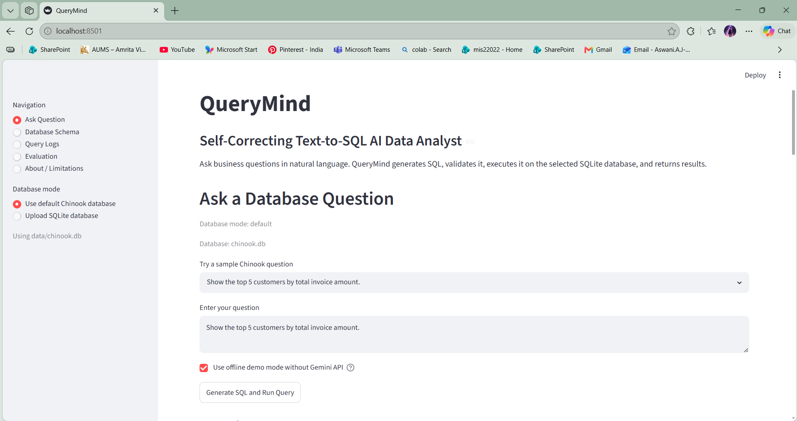

### Offline Demo Mode


### Gemini API Mode

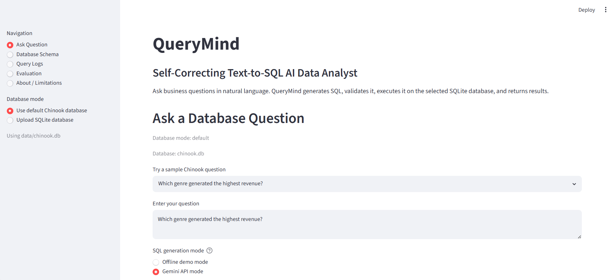

### Gemini API Success

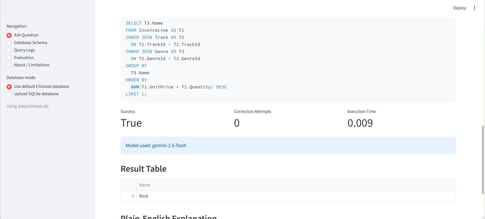

### Generated SQL and Final SQL

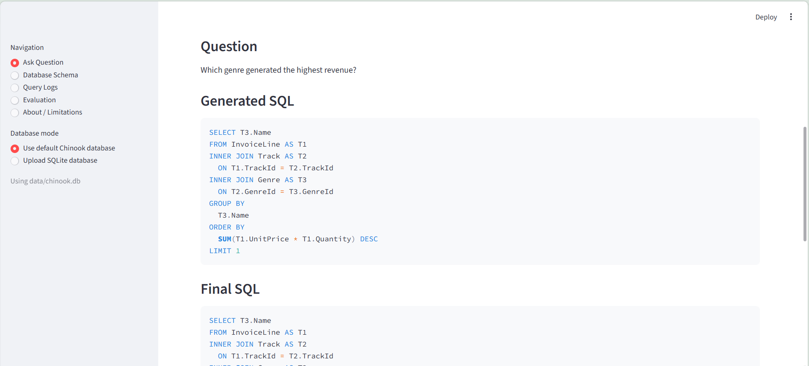

### Result Table and Plain-English Explanation

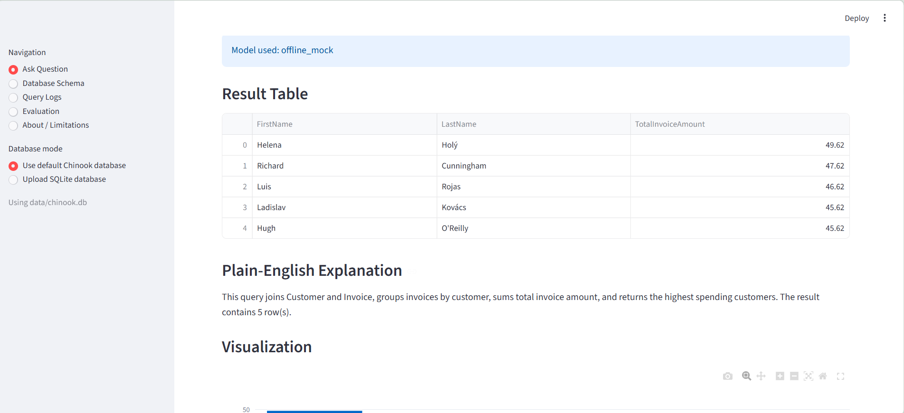

### Visualization

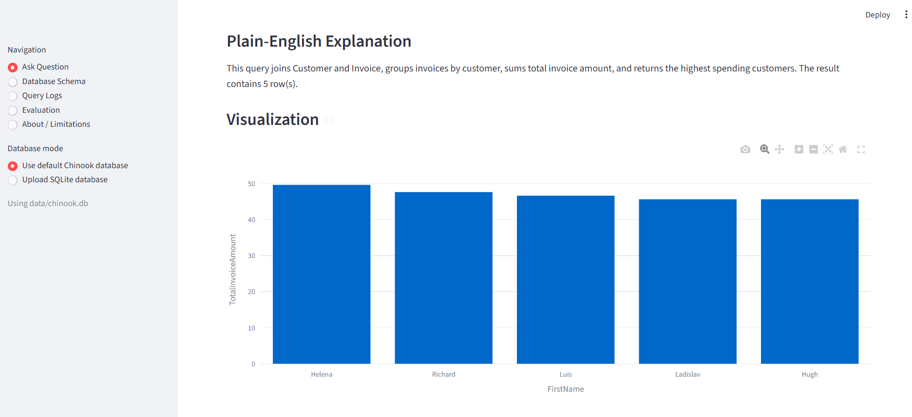

### Database Schema

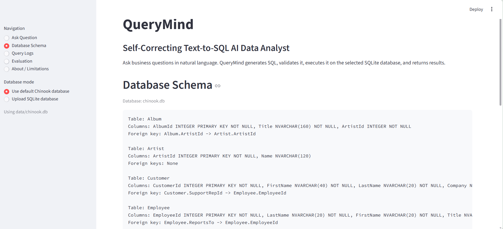

### Query Logs

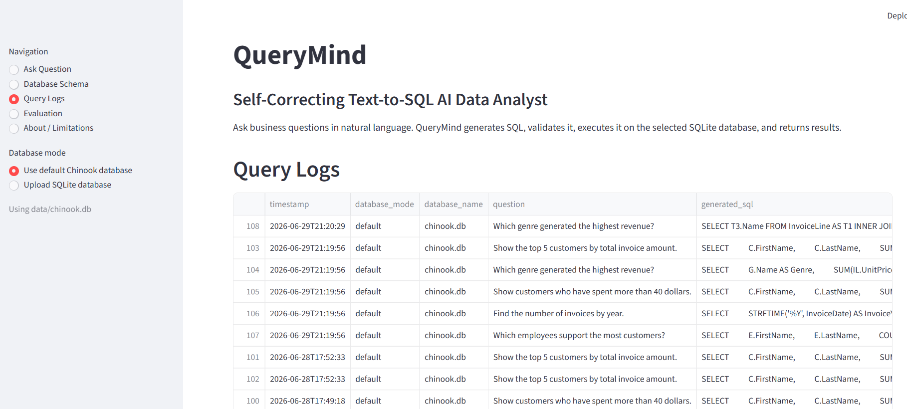

### Evaluation Dashboard

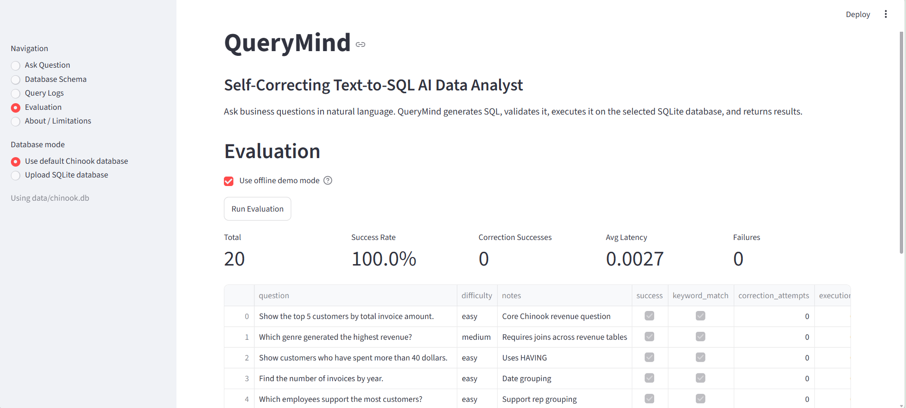

### About and Current Features

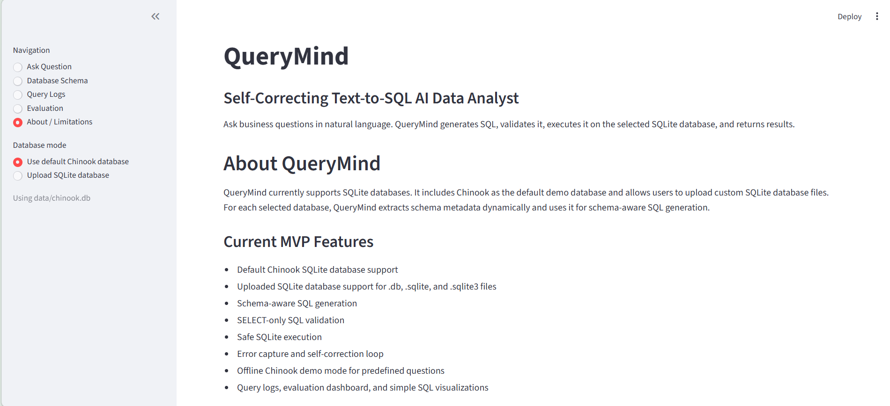

### Limitations

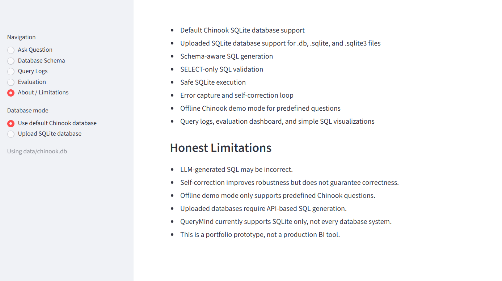

### Uploaded SQLite Database

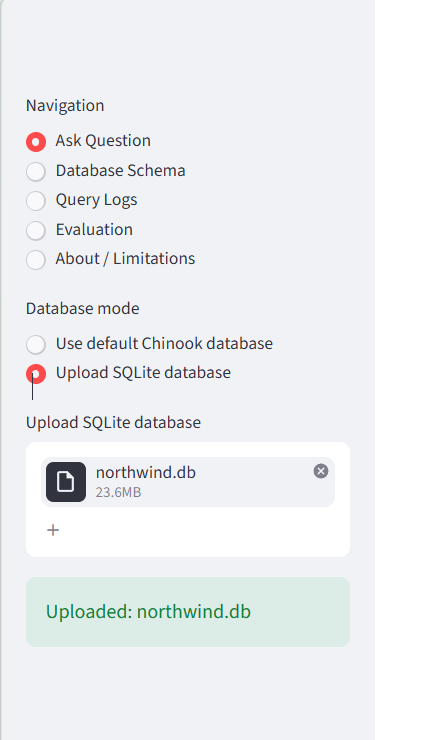

### Friendly Upload and Error Guidance

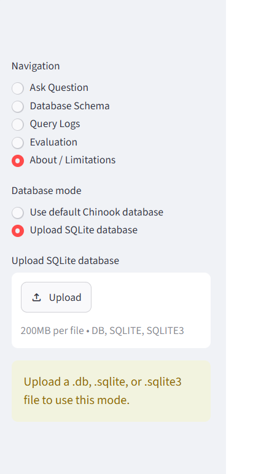

---

## Features

* Natural language to SQL generation
* Schema-aware prompt construction
* Gemini API mode for dynamic SQL generation
* Offline demo mode for reliable Chinook testing
* SQL output cleaning
* SELECT-only SQL validation
* Safe SQLite execution
* Execution-error capture
* Self-correction loop using database error feedback
* Result table display
* Plain-English explanation
* Simple SQL visualizations
* Query logs
* Evaluation dashboard
* Uploaded SQLite database support
* Friendly Gemini quota and rate-limit handling

---

## System Workflow

```text
Natural Language Question
        ↓
SQLite Schema Extraction
        ↓
Schema-Aware Prompt Construction
        ↓
Gemini API / Offline Demo SQL Generation
        ↓
SQL Output Cleaning
        ↓
SELECT-Only SQL Validation
        ↓
Safe SQLite Execution
        ↓
Optional Self-Correction if SQL Fails
        ↓
Final SQL + Result Table
        ↓
Plain-English Explanation + Visualization
        ↓
Query Logging + Evaluation
```

---

## Tech Stack

| Area                   | Tools / Libraries           |
| ---------------------- | --------------------------- |
| Programming Language   | Python                      |
| Frontend               | Streamlit                   |
| Database               | SQLite                      |
| LLM API                | Gemini API                  |
| Data Handling          | Pandas                      |
| Visualization          | Plotly / Streamlit charts   |
| Environment Management | python-dotenv               |
| Validation             | Custom SQL safety validator |

---

## Project Structure

```text
QueryMind/
├── app/
│   └── streamlit_app.py
│
├── src/
│   ├── __init__.py
│   ├── answer_formatter.py
│   ├── evaluator.py
│   ├── logger.py
│   ├── mock_sql_generator.py
│   ├── prompt_builder.py
│   ├── query_pipeline.py
│   ├── schema_reader.py
│   ├── self_corrector.py
│   ├── sql_cleaner.py
│   ├── sql_executor.py
│   ├── sql_generator.py
│   ├── sql_validator.py
│   ├── test_self_correction_pipeline.py
│   ├── utils.py
│   └── visualizer.py
│
├── data/
│   ├── chinook.db
│   └── evaluation_questions.csv
│
├── outputs/
│   ├── evaluation_results.csv
│   ├── query_logs.csv
│   └── uploaded_databases/
│
├── screenshots/
│   ├── selected/
│   ├── extra/
│   ├── raw_backup/
│   ├── README_SCREENSHOTS_SECTION.md
│   └── SCREENSHOT_INDEX.md
│
├── chinook/
├── main.py
├── requirements.txt
├── .gitignore
└── README.md
```

---

## Setup Instructions

### 1. Clone the Repository

```bash
git clone <repo-url>
cd querymind-text-to-sql-agent
```

### 2. Create a Virtual Environment

```bash
python -m venv .venv
```

### 3. Activate the Virtual Environment

On Windows:

```bash
.venv\Scripts\activate
```

On macOS/Linux:

```bash
source .venv/bin/activate
```

### 4. Install Dependencies

```bash
pip install -r requirements.txt
```

### 5. Add Gemini API Key

Create a `.env` file in the project root:

```env
GEMINI_API_KEY=your_gemini_api_key_here
```

Do not commit the `.env` file to GitHub.

---

## How to Run

Run the Streamlit app:

```bash
streamlit run app/streamlit_app.py
```

Then open:

```text
http://localhost:8501
```

---

## How to Use

1. Choose the default Chinook database or upload a SQLite database.
2. Choose Offline demo mode or Gemini API mode.
3. Enter a natural-language database question.
4. Generate and run the SQL query.
5. Review the generated SQL, final SQL, execution status, and result table.
6. Read the plain-English explanation.
7. Inspect the visualization when available.
8. Open the Query Logs page to review previous questions and generated SQL.
9. Open the Evaluation page to inspect benchmark-style MVP checks.

---

## Offline Mode vs Gemini API Mode

| Mode              | Purpose                                        | Requires API Key? | Works with Uploaded DB?    |
| ----------------- | ---------------------------------------------- | ----------------- | -------------------------- |
| Offline demo mode | Demo/testing with predefined Chinook questions | No                | No                         |
| Gemini API mode   | Dynamic schema-aware SQL generation            | Yes               | Yes, if quota is available |

### Offline Demo Mode

Offline mode does not call the Gemini API. It uses predefined SQL examples for the Chinook database.

Use this mode when:

* You want a reliable demo
* Gemini quota is exhausted
* You want to test the UI, logs, evaluation, and visualization

Supported database:

```text
data/chinook.db
```

### Gemini API Mode

Gemini API mode generates SQL dynamically using the selected database schema.

Use this mode when:

* You want dynamic natural language SQL generation
* You want schema-aware prompting
* You are using uploaded SQLite databases

Note: Gemini API mode depends on available API quota.

---

## Example Questions

```text
Show the top 5 customers by total invoice amount.
Which genre generated the highest revenue?
Show customers who have spent more than 40 dollars.
Find the number of invoices by year.
Which employees support the most customers?
Show total sales by billing country.
What are the top 10 most expensive tracks?
Which countries have the highest number of customers?
Which artist has the most tracks?
```

---

## Example Output

For the question:

```text
Show the top 5 customers by total invoice amount.
```

QueryMind can generate SQL similar to:

```sql
SELECT
    C.FirstName,
    C.LastName,
    SUM(I.Total) AS TotalInvoiceAmount
FROM Customer AS C
JOIN Invoice AS I
    ON C.CustomerId = I.CustomerId
GROUP BY
    C.CustomerId,
    C.FirstName,
    C.LastName
ORDER BY
    TotalInvoiceAmount DESC
LIMIT 5;
```

The app returns:

* Generated SQL
* Final validated SQL
* Execution status
* Result table
* Plain-English explanation
* Visualization

---

## SQL Safety

QueryMind includes a custom SQL validator to reduce unsafe database operations.

The validator blocks unsafe SQL operations such as:

```text
DROP
DELETE
UPDATE
INSERT
ALTER
CREATE
TRUNCATE
PRAGMA
ATTACH
DETACH
REPLACE
VACUUM
```

Only read-only `SELECT` queries are allowed.

---

## Self-Correction Logic

If the generated SQL fails during execution, QueryMind captures the database error and can send the failed SQL, error message, user question, and schema context back to the model for correction.

The correction flow is:

```text
Generated SQL
        ↓
Execution Error
        ↓
Correction Prompt with Error Feedback
        ↓
Corrected SQL
        ↓
Revalidation
        ↓
Safe Re-execution
```

This improves robustness, but it does not guarantee perfect SQL correctness.

---

## Query Logs

Each query run is logged with details such as:

* Timestamp
* Database mode
* Database name
* User question
* Generated SQL
* Final SQL
* Success status
* Error message
* Correction attempts
* Execution time
* Model used
* Explanation

Logs are saved in:

```text
outputs/query_logs.csv
```

---

## Evaluation Dashboard

The evaluation dashboard runs predefined test questions and reports:

* Total test cases
* Success rate
* Correction successes
* Average latency
* Failures
* Evaluation result table

Evaluation results are saved in:

```text
outputs/evaluation_results.csv
```

---

## Uploaded SQLite Database Support

QueryMind supports uploading SQLite database files with these extensions:

```text
.db
.sqlite
.sqlite3
```

For uploaded databases, Gemini API mode is required for natural-language SQL generation because offline demo mode only supports predefined Chinook questions.

---

## Current Status

This repository contains the completed MVP version of QueryMind.

Completed:

* Streamlit application
* Chinook SQLite support
* Uploaded SQLite database support
* Offline demo mode
* Gemini API mode
* Schema-aware SQL generation
* SQL cleaning
* SELECT-only SQL validation
* Safe SQLite execution
* Execution-error capture
* Self-correction workflow
* Query logging
* Evaluation dashboard
* Plain-English explanation
* Simple visualization

---

## Current Limitations

* Offline demo mode only supports predefined Chinook questions.
* Gemini API mode depends on available API quota.
* Uploaded databases require Gemini API mode for natural-language SQL generation.
* LLM-generated SQL may still be incorrect.
* Self-correction improves robustness but does not guarantee correctness.
* QueryMind currently supports SQLite databases only.
* This is a portfolio MVP, not a production BI tool.

---

## Future Improvements

Planned future upgrades:

* FastAPI backend version
* Docker support
* Uploaded database preview without API dependency
* Improved SQL validation using SQLGlot
* Spider benchmark evaluation
* BIRD benchmark evaluation
* SQLCoder comparison
* Fine-tuned small Text-to-SQL model
* Authentication and saved workspaces
* Production deployment

---

## Resume-Friendly Project Summary

QueryMind is a self-correcting Text-to-SQL AI data analyst that converts natural language questions into validated SQLite queries, executes them safely, displays results, explains the SQL output, logs query activity, and supports both offline demo and Gemini API modes.

---

## Suggested Resume Title

For AI/ML and Data Analyst resumes:

```text
QueryMind: Self-Correcting Text-to-SQL AI Data Analyst
```

For a future backend-focused version:

```text
QueryMind API: Text-to-SQL Agent Backend
```

---

## Security Note

The `.env` file is ignored and should never be committed. Do not commit API keys, database credentials, or other secrets.

---

## Author

**Aswani A. J**

AI / ML / Data Analytics Portfolio Project
# querymind-text-to-sql-agent

